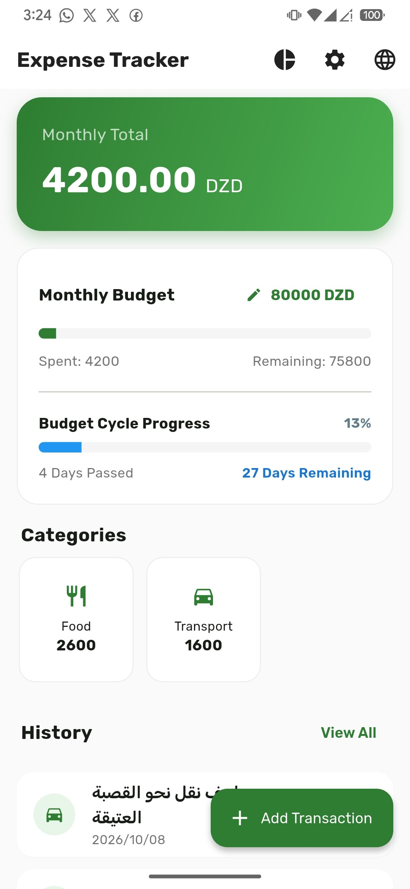

# 💰 متعقب المصاريف (Expense Tracker)

تطبيق متميز لإدارة المصاريف الشخصية بطريقة **محليّة بالكامل (Local-First)**، يركز على الخصوصية التامة وسرعة الأداء، مع دعم كامل للغتين **العربية** و**الإنجليزية**.

---

## ✨ المميزات الرئيسية

- 🔒 **خصوصية مطلقة (Local-First):** جميع بياناتك تخزن محلياً على جهازك باستخدام قاعدة بيانات `SQLite`, ولا يتم رفع أي معلومات لخوادم خارجية.
- 🌍 **دعم ثنائي اللغة (عربي / إنجليزي):** إمكانية التبديل الفوري بين اللغتين مع دعم كامل لتخطيط الاتجاه من اليمين لليسار (`RTL`).
- 📊 **إحصائيات ورسوم بيانية:** عرض تفصيلي للمصاريف الشهرية مقسمة حسب التصنيفات عبر رسوم بيانية تفاعلية (`fl_chart`).
- 🎯 **إدارة الميزانية الشهرية:** تحديد ميزانية شهرية ومتابعة الاستهلاك بشكل لحظي عبر أشرطة تقدم بصرية.
- ⏱️ **تتبع دورة الميزانية الزمنية:** شريط تقدم ذكي يوضح كم مرّ من الشهر وكم تبقى بناءً على تاريخ بداية الميزانية المخصص.
- 📥 **النسخ الاحتياطي (تصدير واستيراد):** إمكانية تصدير بياناتك كملف `JSON` ومشاركتها، أو استعادتها بكل سهولة في أي وقت.
- 🎨 **تصميم عصري:** واجهات مستخدم نظيفة مبنية وفق معايير `Material 3` مع استخدام خطوط محلية (`Rubik`) لإداء فائض وسرعة إقلاع قصوى.

---

## 📸 لقطات الشاشة (Screenshots)

<p align="center">
  
  
  
  
  
</p>

---

## 🛠️ التقنيات المستخدمة

- **Framework:** [Flutter](https://flutter.dev/) (Dart)
- **Database:** `sqflite` (قاعدة بيانات محلية)
- **Local Storage:** `shared_preferences` (لتخزين الإعدادات والميزانية)
- **Charts:** `fl_chart` (للإحصائيات البيانية)
- **Localization:** `intl` & Custom Localization Service
- **Backup & Share:** `file_picker` & `share_plus`

---

## 📂 هيكل المشروع

```text
lib/
│
├── models/         # نماذج البيانات (مثل المعاملات المالية والتصنيفات)
├── screens/        # شاشات التطبيق (الرئيسية، الإضافة، الإحصائيات، الإعدادات، السجل)
├── services/       # خدمات النظام (قاعدة البيانات، الترجمة، النسخ الاحتياطي)
└── theme/          # إعدادات الألوان والخطوط والثيم العام
```

---

## 🚀 كيفية التشغيل والتثبيت محلياً

1. **تثبيت متطلبات التشغيل:**
   تأكد من تثبيت بيئة عمل Flutter على جهازك:
   ```bash
   flutter doctor
   ```

2. **نسخ المستودع (Clone):**
   ```bash
   git clone https://github.com/your-username/expense-tracker.git
   cd expense_tracker
   ```

3. **جلب التبعيات (Dependencies):**
   ```bash
   flutter pub get
   ```

4. **تشغيل التطبيق:**
   قم بتوصيل هاتفك أو تشغيل المحاكي (Emulator), ثم تنفيذ الأمر:
   ```bash
   flutter run
   ```

---

## 🤝 المساهمة

نرحب بمساهماتكم واقتراحاتكم لتطوير التطبيق! إذا واجهتك أي مشكلة أو رغبت في إضافة ميزة جديدة، لا تتردد في فتح `Issue` أو تقديم `Pull Request`.

---

## 📄 الترخيص

هذا المشروع مرخص تحت رخصة MIT. يمكنك استخدام، تعديل، وتوزيع الكود بحرية.

---

I 🤖 **صُنع بكل حماس لتسهيل إدارة الأموال بخصوصية تامة.**
